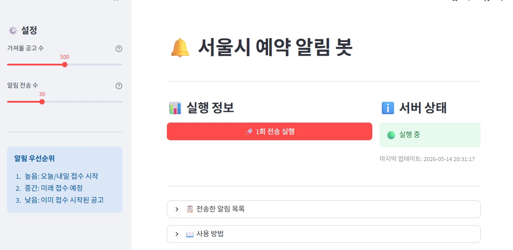

# 서울시 예약 알림 봇 

** 극악의 난이도**로 알려진 서울시 공공서비스 예약 정보를 수집하고 텔레그램으로 알림을 전송합니다.

---

## **라이브 서비스**

### **[➡️ https://seoulscrapapp-ctvc2rakdlyoy5flwn5rff.streamlit.app/](https://seoulscrapapp-ctvc2rakdlyoy5flwn5rff.streamlit.app/)**

현재 운영 중인 실제 서비스입니다. 위 링크를 통해 바로 접속할 수 있습니다.

---

## 기능

- 서울시 공공서비스 예약 정보 수집
- 텔레그램 알림 전송
- 중복 알림 방지 (SQLite)
- 전송한 알림 목록 조회
- Streamlit 웹 인터페이스

## 스크린샷



## 요구사항

- Python 3.8+
- 텔레그램 봇 토큰
- 텔레그램 채팅 ID
- 서울시 공공데이터 API 키

## 설치

```bash
pip install -r requirements.txt
```

## 환경 설정

`.env` 파일 생성:

```env
TELEGRAM_BOT_TOKEN=your_bot_token_here
TELEGRAM_CHAT_ID=your_chat_id_here
SEOUL_API_KEY=your_seoul_api_key_here
```

### 텔레그램 봇 설정

1. [@BotFather](https://t.me/BotFather)에서 `/newbot` 실행
2. 발급받은 토큰을 `.env`에 입력
3. 봇과 대화 시작 후 `https://api.telegram.org/bot<YOUR_BOT_TOKEN>/getUpdates`에서 `chat.id` 확인

### 서울시 API 키

1. [서울 열린데이터광장](https://data.seoul.go.kr/) 가입
2. 인증키 신청
3. 발급받은 키를 `.env`에 입력

## 실행

로컬:
```bash
streamlit run streamlit_app.py
```

Streamlit Cloud:
1. GitHub 저장소 연결
2. Main file: `streamlit_app.py`
3. Secrets에 환경 변수 입력
4. 배포

## 프로젝트 구조

```
seoul_scrap_streamlit/
├── streamlit_app.py
├── scraper.py
├── storage.py
├── notifier.py
└── requirements.txt
```

## 설정

`fetch_limit`: API에서 가져올 최대 공고 수 (기본값: 500)  
`notify_limit`: 텔레그램으로 전송할 최대 알림 수 (기본값: 30)

알림 우선순위:
1. 오늘/내일 접수 시작
2. 미래 접수 예정
3. 이미 접수 시작

수집 대상 서비스:
- 체육시설
- 시설대관
- 교육강좌
- 문화행사
- 진료복지

## 문제 해결

텔레그램 연결 실패:
- `.env` 파일 확인
- 봇 활성화 확인

서울시 API 오류:
- 네트워크 확인
- API 키 확인
- 사용량 제한 확인

데이터베이스 오류:
- 파일 권한 확인
- 손상된 경우 삭제 후 재실행

## 주의사항

- 중복 알림은 SQLite로 방지됨
- Streamlit Cloud 배포 시 재시작하면 DB 초기화됨
- API 호출 간격 조절 필요

## License

MIT
